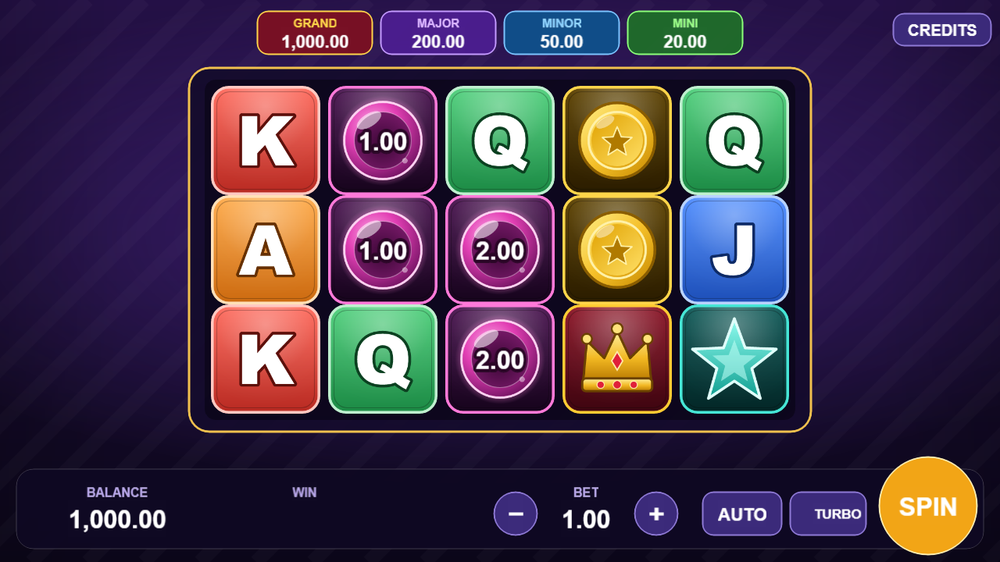
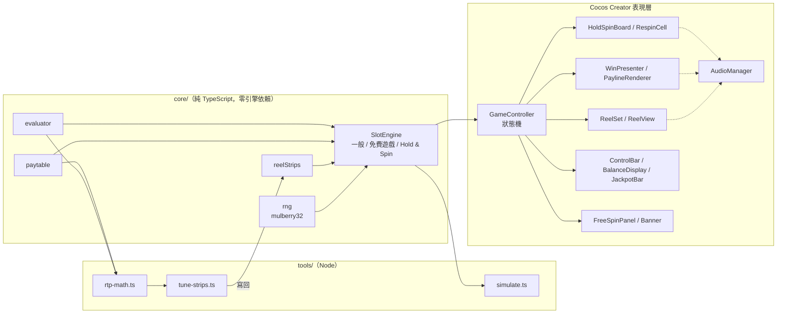
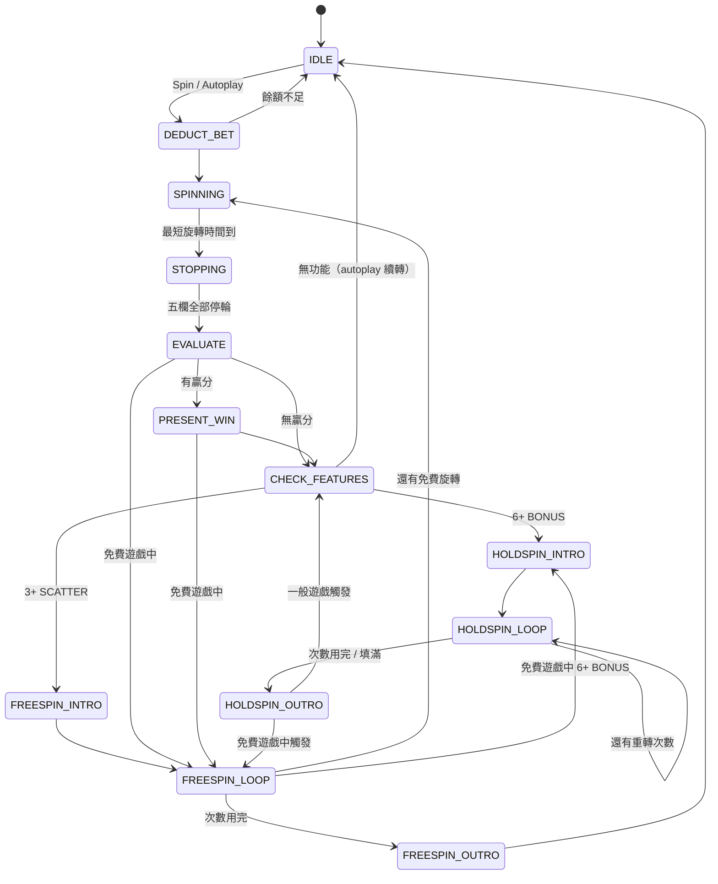
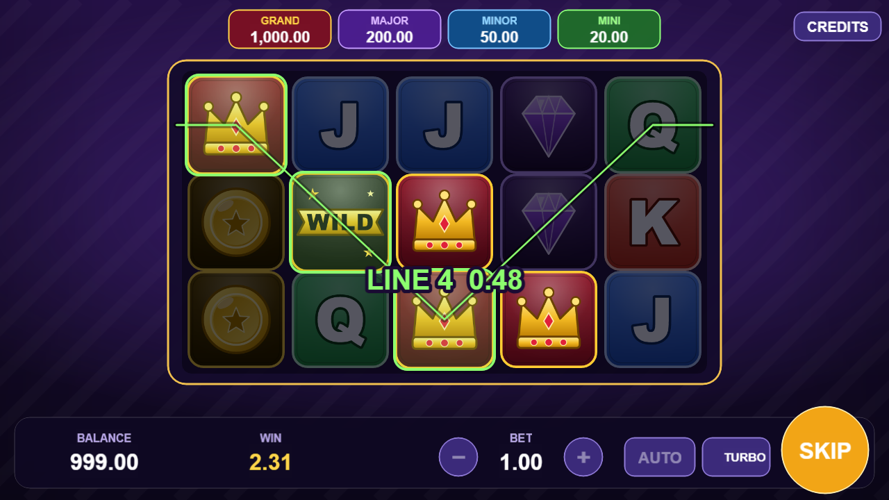
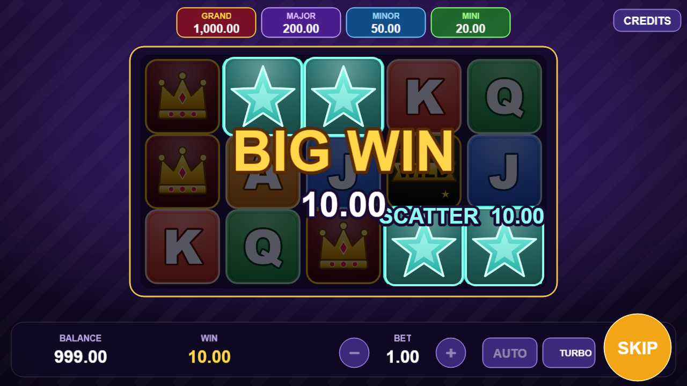
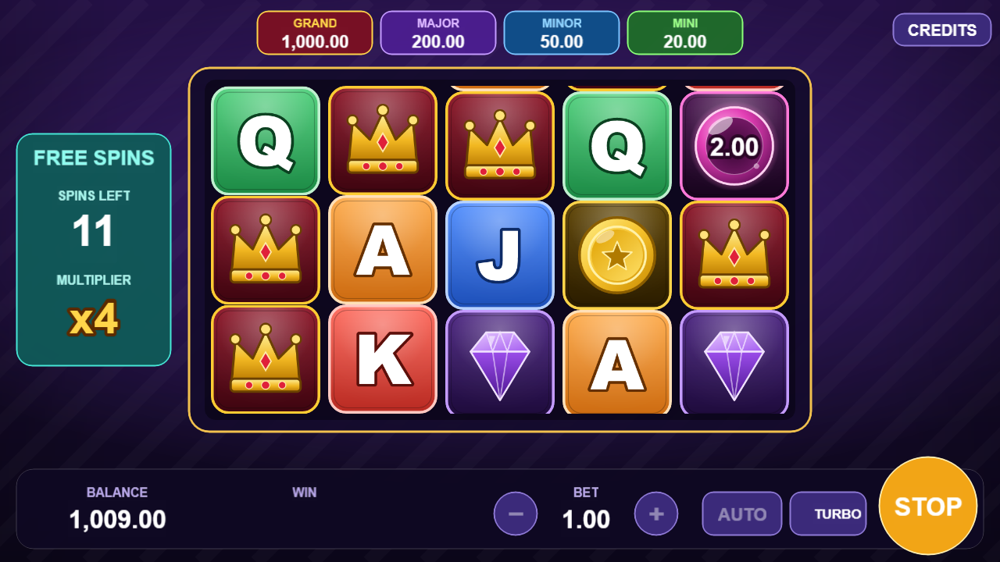
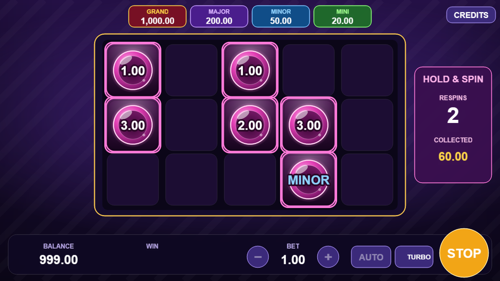
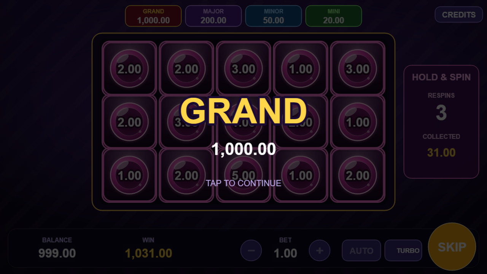

# Slot Game — 5x3 / 25 線老虎機

以 **Cocos Creator 3.8.8 + TypeScript** 製作的 5 欄 3 列、25 條固定中獎線老虎機，包含免費遊戲、Hold & Spin 與固定倍數 Jackpot。

這個專案的重點不在功能數量，而是把一款 slot 從「數學設計 → 數值驗證 → 表現層」完整做過一遍，每一層都能獨立說明與驗證：

- **數學是自己設計的**：reel strip 組成、堆疊排列，以及線贏分、免費遊戲、Hold & Spin 的 RTP 精確解析，並以百萬次模擬交叉驗證。
- **核心邏輯與表現層分離**：`core/` 不依賴引擎，同一份程式碼同時驅動遊戲與模擬腳本。
- **集中式狀態機**：所有狀態轉移與玩家輸入的解讀集中在一處。
- **表現層細節**：真實 strip 停輪、物件池、逐欄停輪與回彈、anticipation、逐線中獎演出、免費遊戲倍數、Hold & Spin 迷你滾輪與 Jackpot 演出。



---

## 目錄

- [遊戲規則](#遊戲規則)
- [數學設計](#數學設計)
- [RTP 報告摘要](#rtp-報告摘要)
- [架構](#架構)
- [狀態機](#狀態機)
- [表現層細節](#表現層細節)
- [場景與美術素材的生成方式](#場景與美術素材的生成方式)
- [本地執行](#本地執行)
- [專案結構](#專案結構)

---

## 遊戲規則

| 項目 | 規格 |
|---|---|
| 盤面 | 5 欄 x 3 列，25 條固定 payline |
| 符號 | 低賠付 J / Q / K / A、高賠付 H1 寶石 / H2 金幣 / H3 皇冠、WILD、SCATTER、BONUS 寶珠 |
| 連線 | 由最左欄開始連續 3 個以上；每條線只取該線最高的一組賠付 |
| WILD | 替代除 SCATTER、BONUS 外的所有符號，本身不賠付 |
| SCATTER | 不受 payline 限制，依總注賠付：3 個 2x、4 個 10x、5 個 50x |
| 免費遊戲 | 3 / 4 / 5 個 SCATTER 觸發 10 / 15 / 20 次；可重觸發追加次數 |
| 免費遊戲倍數 | 從 x1 開始，每轉完一次 +1，上限 x5，重觸發不重置 |
| BONUS | 每顆帶一個獎項：總注 1x ~ 10x 的現金，或 MINI / MINOR / MAJOR Jackpot；不參與連線 |
| Hold & Spin | 盤面 6 個以上 BONUS 觸發，重轉 3 次：BONUS 鎖定不動、其餘格子重轉，有新 BONUS 落下時次數重設為 3；次數用完或填滿 15 格時結束，贏得所有 BONUS 的獎項 |
| Jackpot | 固定為總注倍數：MINI 20x、MINOR 50x、MAJOR 200x（出現在 BONUS 上），GRAND 1000x（填滿 15 格） |
| 功能並存 | 免費遊戲中也能觸發 Hold & Spin，贏分不乘免費遊戲倍數、併入該輪免費遊戲總贏分；同一轉同時觸發兩者時先進行 Hold & Spin |
| 其他 | Autoplay（10 / 25 / 50 次）、Turbo 模式、快速停止、略過演出、Credits 製作者資訊 |

### 賠付表（線注倍數，線注 = 總注 / 25）

| 符號 | 3 連 | 4 連 | 5 連 |
|---|---|---|---|
| J / Q | 2 | 5 | 15 |
| K / A | 3 | 8 | 25 |
| H1 寶石 | 5 | 20 | 60 |
| H2 金幣 | 8 | 30 | 100 |
| H3 皇冠 | 12 | 50 | 250 |

### BONUS 獎項（一般遊戲、免費遊戲與重轉共用）

| 獎項 | 總注倍數 | 權重 | 機率 |
|---|---|---|---|
| 現金 | 1x / 2x / 3x / 5x / 10x | 420 / 260 / 150 / 90 / 50 | 42% / 26% / 15% / 9% / 5% |
| MINI | 20x | 20 | 2% |
| MINOR | 50x | 7 | 0.7% |
| MAJOR | 200x | 3 | 0.3% |

重轉時，每個未鎖定格各自有 5% 的機率落下新的 BONUS。

---

## 數學設計

目標：**RTP 96.0%（允收 95.5% ~ 96.5%）、hit frequency 17% ~ 23%、高波動、Hold & Spin 約佔總 RTP 四分之一，且停輪結果不出現整欄相同符號**。

### 1. 為什麼用 reel strip，而不是逐格權重抽樣

每一欄是一條固定的符號序列（53 ~ 54 格），每次 spin 為每欄抽一個停輪位置，取連續 3 格。

- 這是實體與線上 slot 的實際做法，數學與畫面是**同一個模型**：停輪時滾入的就是真實 strip，停輪位置直接對應結果，不需要「轉完再換圖」。
- 相鄰格子之間有關聯（例如堆疊），這是逐格獨立抽樣做不到的，而它正是調整波動性的主要工具（見下方第 4 點）。

Strip 設計規則（由 `tools/lib/strip-rules.ts` 檢查，並納入單元測試）：

- 第 0 欄不放 SCATTER，讓觸發一定要等到後面幾欄，拉長懸念。
- 每條 strip 最多 2 個 SCATTER，彼此間隔至少 8 格，確保同一欄視窗不會出現兩個。
- WILD 只在第 1 ~ 3 欄。第 0 欄沒有 WILD，連線的符號就一定由第一欄決定，玩家看得懂；第 4 欄沒有 WILD，5 連更難得。
- BONUS 最多連續 2 格，兩組之間至少相隔 2 格：單欄最多出現 2 個 BONUS，不會整欄都是 BONUS；一個視窗只會碰到一組，BONUS 的數量分佈才能由組成精確推得（見第 2 點）。
- 最右欄的高賠付符號密度不超過最左欄。

### 2. RTP 精確解析（不靠抽樣）

`tools/lib/rtp-math.ts` 直接算出理論 RTP，總 RTP = 線贏分 + SCATTER + 免費遊戲 + Hold & Spin，各項依期望值線性相加，每一項只需要自己的機率分佈：

- **線贏分**：每條 payline 在每一欄只取一格，而每一格的符號分佈就等於該 strip 的組成比例，且各欄停輪彼此獨立。因此單線期望賠付**只取決於各欄的符號組成、與排列無關**，列舉 10⁵ = 100,000 種符號組合即可精確計算（BONUS 視為會中斷連線的符號）；25 條線的期望值相同，直接加總。
- **SCATTER**：同一欄視窗最多一個，每欄出現機率 = 數量 × 3 / 長度，跨欄卷積得到全盤面數量分佈。
- **BONUS 數量**：2 格一組的 BONUS 會讓 4 個停輪位置分別看到 1、2、2、1 個，落單的 1 格讓 3 個停輪位置各看到 1 個，由此得到每欄視窗的 BONUS 數量分佈，再跨欄卷積。
- **Hold & Spin**：以「已鎖定格數 × 剩餘重轉次數」為狀態做動態規劃。m 個未鎖定格各自以 5% 落下 BONUS，新落下的數量服從二項分佈；落下 0 個時次數減一，否則鎖定並重設為 3。求出結束時的格數分佈後，因為每顆 BONUS 的獎項彼此獨立、且與格數無關，
  `每次觸發的期望贏分 = 期望結束格數 × 單顆 BONUS 期望值 + 填滿機率 × 1000`。
- **免費遊戲**：第 i 轉的倍數是 min(i, 5)，而「第 i 轉是否發生」只取決於之前的結果，與第 i 轉的贏分獨立，所以
  `每次觸發的期望線贏分 = 單轉期望回報 × Σ min(i, 5) × P(免費遊戲長度 ≥ i)`，
  其中 P(長度 ≥ i) 用動態規劃（含重觸發）求出。免費遊戲中的每一轉也能觸發 Hold & Spin，而 Hold & Spin 贏分不乘倍數，
  `Hold & Spin RTP = 單轉的 Hold & Spin 期望回報 × (1 + 每次付費 spin 平均帶來的免費旋轉次數)`。

單元測試以三種方式確認解析公式與遊戲邏輯一致：

- 用遊戲實際的 evaluator 暴力列舉所有停輪組合，線贏分、SCATTER 與 BONUS 數量分佈的誤差都在 1e-10 以內。
- 以「逐格列舉每個未鎖定格是否落下 BONUS」的另一種推導計算 Hold & Spin，與動態規劃的結果誤差在 1e-12 以內。
- 讓引擎實際重轉 4 萬次 Hold & Spin，平均結束格數與收集金額都與解析值一致。

### 3. 自動調校

`tools/tune-strips.ts` 的流程：

1. 以 `DESIGN` 定義的組成為起點。前三欄的主要符號**互相錯開**：每欄以 2 ~ 3 種符號為主（各 8 ~ 14 格），其餘符號只放 3 ~ 5 格，同一符號很少在第 0 ~ 2 欄同時大量出現，單線中獎機率因此大幅下降；WILD 集中在第 3 欄；BONUS 每欄 4 ~ 6 個。這組起點是以精確解析搜尋「RTP 96%、Hold & Spin 佔比、單線中獎機率」的平衡點得到，理論 RTP 已落在目標內。
2. 每一步嘗試「某欄某個低賠付符號 ±1」與「同欄兩個低賠付符號互換一格」的所有調整，以精確解析選出最接近目標的一步，貪婪收斂。±1 會改變 strip 長度、稀釋或集中整條 strip 的所有符號，互換則長度不變、RTP 變化細得多，適合最後的微調。因為不需要抽樣，每次執行結果完全相同。
3. 依組成排列 strip、檢查設計規則，並以實際排列出的 strip 重新解析一次，確認與組成模型（含 BONUS 視窗分佈）完全一致。
4. 以蒙地卡羅確認 hit frequency 落在範圍內，全部通過才寫回 `assets/scripts/core/reelStrips.ts`。

### 4. 波動性：用組成錯開與堆疊（stack）調整 hit frequency

RTP 只取決於組成，**排列方式不會改變 RTP，但會改變中獎的分佈**。前三欄主要符號互相錯開，讓連線本身不容易成立；再把同一符號排成堆疊，中獎會集中在同一次 spin 的多條線上。以最終組成、不同堆疊方式各模擬 100 萬次（BONUS 在四種排列中都是 2 格一組）：

| 同一組成的排列方式 | 理論 RTP | hit frequency | 單次 spin 標準差 | 停輪時單欄 3 格全同 | 停輪時單欄有相鄰兩格相同 |
|---|---|---|---|---|---|
| 無堆疊 | 96.00% | 32.27% | 6.93 | 0% | 8.18% |
| 低賠付 2 格 | 96.00% | 29.81% | 6.55 | 0% | 46.11% |
| 全部 2 格 | 96.00% | 16.93% | 7.00 | 0% | 85.52% |
| **高賠付 2 格（採用）** | **96.00%** | **21.60%** | **7.83** | **0%** | **47.59%** |

更長的堆疊（例如 4 格）同樣能壓低 hit frequency，但停輪時經常整欄都是同一符號，看起來很不隨機。只讓高賠付符號 2 格一組：hit frequency 落在目標區間中段、標準差最高（贏分集中在高賠付連線上），欄內相鄰重複只有「全部 2 格」的一半左右，整欄相同則完全不會出現。同樣的回報率，從「經常小贏」變成「較少中獎、但一中就是多條線」，這就是高波動的手感。

### 5. Hold & Spin 的數值

**重轉落下機率決定 GRAND 有多難。** 以 6 個 BONUS 觸發為例，重轉時每格落下 BONUS 的機率對結果的影響：

| 每格落下機率 | 平均結束格數 | 填滿 15 格（GRAND） |
|---|---|---|
| **5%（採用）** | **8.28** | **每 610 次** |
| 6% | 8.87 | 每 216 次 |
| 7% | 9.45 | 每 97 次 |
| 8% | 10.01 | 每 51 次 |
| 10% | 11.01 | 每 20 次 |

填滿就給 1000x，機率每提高 1%，GRAND 的頻率就大幅上升。採用 5%，GRAND 約每 573 次 Hold & Spin 出現一次（考慮觸發時的 BONUS 數量分佈），一般遊戲大約每 8.7 萬轉一次，保持「可遇不可求」。

**獎項與觸發頻率決定 Hold & Spin 佔多少 RTP。** 單顆 BONUS 的期望值為 3.69x（現金 2.34x + Jackpot 1.35x），每次觸發平均結束時有 8.43 顆，加上 GRAND，每次觸發期望贏分 32.84x；BONUS 每欄 4 ~ 6 個，一般遊戲約每 152 轉觸發一次，Hold & Spin 佔總 RTP 22.71%。

### 最終 strip 組成

| 欄 | 長度 | J | Q | K | A | H1 | H2 | H3 | WILD | SCATTER | BONUS |
|---|---|---|---|---|---|---|---|---|---|---|---|
| 0 | 53 | 5 | 3 | 12 | 5 | 3 | 10 | 10 | 0 | 0 | 5 |
| 1 | 54 | 7 | 8 | 3 | 10 | 3 | 3 | 13 | 1 | 2 | 4 |
| 2 | 54 | 9 | 4 | 3 | 5 | 8 | 3 | 14 | 0 | 2 | 6 |
| 3 | 54 | 3 | 4 | 4 | 3 | 4 | 10 | 13 | 6 | 2 | 5 |
| 4 | 54 | 3 | 9 | 9 | 7 | 3 | 3 | 14 | 0 | 2 | 4 |

---

## RTP 報告摘要

`pnpm simulate` 以遊戲實際使用的 `SlotEngine` 跑 100 萬次 spin（seed 20260913，總注 1.00），完整報告見 [`tools/output/rtp-report.md`](tools/output/rtp-report.md)。

| 指標 | 模擬 | 理論值 |
|---|---|---|
| **總 RTP** | **97.15%** | **96.00%** |
| 一般遊戲（線贏分 + SCATTER） | 60.59% | 60.13% |
| 免費遊戲（線贏分 + SCATTER） | 13.53% | 13.15% |
| Hold & Spin（含免費遊戲中觸發） | 23.03% | 22.71% |
| Hit frequency（含觸發的功能） | 21.60% | — |
| 免費遊戲觸發頻率 | 每 201.3 轉 | 每 198.8 轉 |
| 每次觸發平均免費旋轉 | 10.72 次 | 10.70 次 |
| Hold & Spin 觸發頻率（一般遊戲） | 每 155.7 轉 | 每 152.4 轉 |
| 每次 Hold & Spin 結束時平均 BONUS | 8.46 顆 | 8.43 顆 |
| 每次 Hold & Spin 平均贏分 | 34.00x | 32.84x |
| GRAND | 20 次 | 每 573 次 Hold & Spin |
| 最大單次贏分（含觸發的所有功能） | 1,095x | — |
| 標準差（單次 spin） | 7.83 | — |
| RTP 95% 信賴區間 | ± 1.53% | — |

單次 spin 贏分分佈（總注倍數，含觸發的所有功能）：

| 0x | 0 – 1x | 1 – 5x | 5 – 20x | 20 – 50x | 50x+ |
|---|---|---|---|---|---|
| 78.40% | 12.70% | 5.15% | 2.38% | 1.16% | 0.21% |

> 在標準差 7.8 的波動下，100 萬次模擬的 RTP 95% 信賴區間約 ±1.5%，單一 seed 的模擬結果本來就會在理論值附近浮動。這次模擬出現 20 次 GRAND（依理論約 12 次），每次 1000x，光是多出的 8 次就讓模擬 RTP 高出約 0.8%。
> 這也是另外做精確解析的原因：**RTP 以理論值驗收，模擬只要求落在理論值的信賴區間內，用來驗證實作與理論一致**（觸發頻率、平均免費旋轉次數、平均 BONUS 數的模擬值都與理論值非常接近）。

---

## 架構



**為什麼這樣分層**

- `assets/scripts/core/` 禁止 `import 'cc'`，也禁止 `Math.random`（由 ESLint 規則強制）。所以模擬腳本跑的不是「另外寫的一份數學」，而是**遊戲實際執行的同一份程式碼**，模擬結果才有意義。
- `SlotEngine` 只負責產生結果與計分，不管餘額、動畫或 UI。餘額、autoplay、turbo 由 `GameController` 管理，表現層只拿 `SpinResult` / `RespinResult` 做演出。
- RNG 可注入、可設定 seed，且取用順序固定（停輪位置 → 盤面上每個 BONUS 的獎項；重轉時依欄、列順序逐格判定），單元測試與模擬都可以重現。遊戲的 debug 參數 `?seed=` 也使用同一套 RNG，瀏覽器內第 N 轉（含每次重轉）的結果與 Node 中完全相同，方便重現問題。
- 金額一律以「分」為單位的整數計算，總注必須是 25 的倍數，線注永遠是整數；BONUS 獎項與 Jackpot 都是總注的整數倍，不會有浮點誤差。
- 音效尚未製作，但所有需要音效的時間點（按鈕、開始旋轉、停輪、anticipation、中獎、免費遊戲、Hold & Spin 觸發、BONUS 鎖定、Jackpot）都已呼叫 `AudioManager.instance`，之後只要注入實作即可。

---

## 狀態機



**設計重點**

- **轉移集中管理**：所有狀態切換只經過 `enter()`，並以轉移表檢查合法性；不合法的轉移會直接拋錯，而不是默默進入奇怪的狀態。
- **輸入依狀態解讀**：玩家的所有操作都經過 `handleInput()`，由目前狀態決定意義，元件內不做任何狀態判斷。
- **功能的先後順序**：同一轉同時觸發兩種功能時，`CHECK_FEATURES` 先進入 Hold & Spin，結束後回到 `CHECK_FEATURES` 再進入免費遊戲。Hold & Spin 結束後依觸發來源回到 `CHECK_FEATURES` 或 `FREESPIN_LOOP`，引擎也會拒絕在 Hold & Spin 結束前進行下一次旋轉。

| 狀態 | Spin 按鈕 | 下注 ± | Autoplay | Turbo |
|---|---|---|---|---|
| IDLE | 開始一局 | 可 | 開始 | 可 |
| SPINNING / STOPPING | **快速停止**（不會重新下注） | 否 | 可停止 | 下一轉生效 |
| PRESENT_WIN | 略過演出 | 否 | 可停止 | 下一轉生效 |
| HOLDSPIN_LOOP | **快速停止**（剩餘格子立即停輪） | 否 | — | 下一次重轉生效 |
| HOLDSPIN_INTRO / OUTRO | 略過橫幅 / 結算累加 | 否 | — | 下一轉生效 |
| FREESPIN_INTRO / OUTRO | 略過橫幅 | 否 | — | 下一轉生效 |

- **Autoplay** 在餘額不足、觸發免費遊戲或 Hold & Spin 時自動暫停；停止 autoplay 在本局結束後生效，不會打斷正在進行的演出。
- 免費遊戲期間下注額鎖定為觸發時的下注額（由 `SlotEngine` 檢查）；Hold & Spin 一律以觸發時的總注計算獎項。

---

## 表現層細節

### 滾輪：真實 strip 滾動 + 物件池

`ReelView` 以「磁帶」模型描述滾動：`pos` 代表最上方可視列正對 strip 的哪個索引，往下滾時 `pos` 遞減，每個符號節點的 y 座標由 `(pos - 索引) × 格高` 算出。

- **物件池**：每欄固定 5 個符號節點（3 可視 + 上下各 1 緩衝）。滾出下界的節點回收到最上方，並換成新的符號。整局遊戲不會再 `instantiate` 或銷毀任何符號節點，連續旋轉不會產生 GC 壓力或節點累積。
- **旋轉填充符號**：strip 含高賠付符號與 BONUS 的 2 格堆疊，旋轉時直接顯示會看到一段段相同符號。因此除了最終停輪視窗之外，從上方進入的一律是依 strip 組成隨機抽出、且上下 2 格內不重複的填充符號，純屬表現，不影響結果。
- **停輪對齊**：開始停輪時算出目標位置，只有最終視窗（3 格可視列加上方緩衝格）顯示真實 strip，並確保這段視窗全部是之後才從上方進入的格子；接著只要把 `pos` 對齊到引擎給的 `stopIndices`，結果符號自然會依序從上方進入可視區。畫面與結果在結構上就不可能不一致，而不是靠「停下來那一刻換貼圖」。
- **BONUS 獎項**：停輪視窗內的 BONUS 進場時就帶著引擎抽出的獎項（現金依總注換算為金額，Jackpot 顯示名稱與代表色）；旋轉中的填充 BONUS 依獎項權重隨機顯示。下注額改變時，畫面上所有 BONUS 的金額立即重新換算。
- **回彈**：越過目標 15px 後，以 120ms 彈回格線。
- **逐欄停止**：欄與欄間隔 120ms（Turbo 40ms）。

### Anticipation

當已經落定的欄位累積 **2 個 SCATTER**（差一個觸發免費遊戲）或 **4 個 BONUS**（單欄最多 2 個，差一欄就觸發 Hold & Spin）時，剩下的每一欄會：

1. 等前面的欄位全部落定，讓玩家看清楚已經差一點就能觸發；
2. 減速旋轉，並在該欄外圍畫出脈動的金 / 青色邊框；
3. 一欄一欄地慢慢停下（每欄 1.3 秒，Turbo 0.6 秒）。

因為第 0 欄沒有 SCATTER，SCATTER 的 anticipation 最早出現在第 3 欄。這是 slot 最重要的情緒節奏：玩家在結果揭曉前就知道「有機會」，等待本身就是體驗的一部分。按下 Spin 快速停止時會取消 anticipation。

### 中獎演出

1. 非中獎格降低亮度，讓視線集中在中獎符號上。
2. 依序播放每一條中獎線：以 `Graphics` 依 payline 定義即時畫出線條（寬 4、圓角端點、四色輪替，**不需要 25 張線條圖**），中獎格加上外框、符號脈動，並在旁邊顯示該線贏分。每條停留 800ms（Turbo 400ms）。
3. 總贏分以 count-up 滾動，時長依贏分級距調整；總贏分 ≥ 10 / 25 / 50 倍總注時顯示 BIG / MEGA / EPIC WIN。
4. 播完後進入「所有中獎線同時高亮」的循環，直到玩家下一次操作。

| 逐線演出 | 分級演出 |
|---|---|
|  |  |

### 免費遊戲

觸發後顯示進場橫幅，盤面左側 HUD 顯示剩餘次數與目前倍數（倍數變化時放大彈出）；重觸發時顯示追加次數；結束時顯示本輪總贏分（含期間觸發的 Hold & Spin）。



### Hold & Spin 與 Jackpot

1. **盤面**：15 格各自是只有一格高的迷你滾輪（`RespinCell`），覆蓋在滾輪上方。每格以兩個符號面循環滾動，要求停輪後，下一個進場的面才換成結果並回彈對齊；和主滾輪一樣，結果一定是從上方進場，而不是停下來才換圖。已鎖定的格子不再轉動，外框發光。
2. **HUD**：盤面右側顯示剩餘重轉次數（重設為 3 時放大彈出）與已收集金額；免費遊戲中觸發時，左側的免費遊戲 HUD 同時保留。
3. **逐格停輪**：未鎖定的格子依欄、列順序停下；只剩最後一格時，這一格決定能否填滿盤面拿到 GRAND，外框脈動並放慢揭曉。
4. **結算**：依序強調每顆 BONUS 並累加贏分，Jackpot 同時閃動盤面上方對應的牌匾；填滿 15 格另外演出 GRAND，最後顯示總贏分橫幅。
5. **Jackpot 列**：盤面上方常駐四個 Jackpot 的金額（固定倍數 × 目前下注額），切換下注額時同步更新。
6. **驗證**：結算金額由盤面上實際顯示的獎項計算，console 會與引擎結果、贏分顯示三方比對；每次重轉後也比對盤面上鎖定的獎項與引擎結果。

| 重轉 | GRAND |
|---|---|
|  |  |

---

## 場景與美術素材的生成方式

### 場景：宣告式生成器

`tools/gen-scene.ts` 以 TypeScript 物件描述整棵節點樹，由 `tools/lib/cocos-json.ts` 序列化為 Cocos Creator 3.8 的場景 / prefab JSON。

- **統一管理 `__id__`**：節點與元件之間的引用用 `ref('key')` 宣告，序列化最後一次解析，並驗證所有索引都在範圍內。手寫上千行 JSON 的索引錯誤在這裡不會發生。
- **腳本元件的 `__type__`**：Cocos 以壓縮成 23 字元的腳本 uuid 作為類別 id。壓縮演算法以編輯器內建資產（`.ts.meta` 與其 prefab）的實際資料寫成單元測試驗證。
- **不引用任何資產 uuid**：貼圖與 prefab 全部放在 `assets/resources/`，runtime 以 `resources.load()` 載入；UI 底圖（面板、按鈕、Jackpot 牌匾、Hold & Spin 格子）以 `PanelGraphic` 元件用 `Graphics` 繪製。場景檔因此不會出現「子資產 uuid 寫錯，編輯器靜默顯示空白」的問題，序列化器也會拒絕輸出任何 `__uuid__`。
- **可重複生成**：`.meta` 的 uuid 一旦產生就不再改寫；節點 id 由雜湊產生，重新生成時 diff 保持乾淨。

### 美術素材：程式生成

`tools/gen-symbols.ts` 以程式組出 SVG，再用 resvg 光柵化為 256x256 PNG。所有符號共用相同的外框、圓角與內縮留白，讓盤面上的視覺重量一致。BONUS 寶珠中央保留深色區域，獎項文字由遊戲以 Label 疊加，同一張貼圖就能顯示任意金額與 Jackpot。背景為 1920x720 的純裝飾圖；畫面固定 16:9（見下方解析度），實際只會顯示中央 1280x720。

### 解析度

設計解析度 1280x720，`fitWidth`（固定寬度）。網頁版由 `index.html` 的 `fitGameDiv()` 把遊戲容器維持在 16:9：瀏覽器寬高比 ≤ 16:9 時遊戲寬等於瀏覽器寬，否則遊戲高等於瀏覽器高，另一邊等比例縮放，並在視窗中水平、垂直置中。畫布因此永遠是 16:9，整個 1280x720 畫面等比縮放、不裁切任何內容；比 16:9 寬的視窗左右留黑邊，比 16:9 窄的視窗上下留黑邊。

---

## 本地執行

### 需求

- Node.js 20+、pnpm
- Cocos Creator 3.8.8

### 工具鏈

```bash
pnpm install

pnpm test          # 單元測試（核心數學、Hold & Spin、序列化器、RTP 解析）
pnpm lint          # ESLint（含 core/ 禁止引用引擎的規則）
pnpm typecheck     # 工具與測試的型別檢查

pnpm simulate                          # 100 萬次 RTP 模擬，輸出 tools/output/rtp-report.md
pnpm simulate --spins 5000000 --seed 42 --bet 250

pnpm tune          # 重新調校 reel strip 並寫回 reelStrips.ts（--dry-run 只輸出結果）
pnpm gen:symbols   # 重新產生符號與背景貼圖
pnpm gen:scene     # 重新產生 Main.scene 與 prefab
```

### 遊戲

以 Cocos Creator 3.8.8 開啟專案根目錄，開啟 `assets/scenes/Main.scene` 後按預覽即可。

### 建置與部署

```bash
pnpm build:web
```

[`tools/build-web.sh`](tools/build-web.sh) 會以 Cocos Creator 3.8.8 命令列、依 [`tools/build-web-desktop.json`](tools/build-web-desktop.json)（release）建置 web-desktop 版本；建置成功（退出碼 36）後，自動執行 `/commit` 將所有變更連同 `build/web-desktop/` 產物一起提交。

- 找不到執行檔時，可用環境變數 `COCOS_CREATOR`、`CLAUDE_BIN` 指定路徑。
- 網頁圖示放在 `build-templates/web-desktop/favicon.ico`，建置時會自動複製到產物中。
- 產物約 4 MB，也可以任意靜態伺服器在本機預覽，例如 `npx serve build/web-desktop`。

網站以 Cloudflare Pages 的 Git 整合部署：Pages 專案連接此 GitHub repository，push 到 `master` 後由 Cloudflare 自動部署已提交的 `build/web-desktop/`。Cocos Creator 只在本機建置，Cloudflare 端不執行建置。

Pages 專案設定：

| 設定 | 值 |
|---|---|
| Production branch | `master` |
| Framework preset | None |
| Build command | （留空） |
| Build output directory | `build/web-desktop` |
| 環境變數 | `SKIP_DEPENDENCY_INSTALL` = `1`（略過 pnpm install，工具鏈依賴不需要在 Cloudflare 上安裝） |

### Debug 參數

| 參數 | 說明 |
|---|---|
| `?seed=782` | 固定 RNG seed，結果與 Node 端 `new SlotEngine(createRandom(782))` 完全一致 |
| `?turbo=1` | 預設開啟 Turbo |
| `?autospin=100` | 經由正常輸入流程連續旋轉 100 次，結束後輸出驗證摘要 |
| `?auto=10` | 以 Autoplay 按鈕相同的輸入啟動 10 次自動旋轉 |
| `?seed=31` | 第一轉就觸發 Hold & Spin |
| `?seed=65591` | 第一轉觸發 Hold & Spin 並填滿盤面拿到 GRAND |
| `?seed=1879` | 在免費遊戲中觸發 Hold & Spin |

每次停輪、中獎與重轉，console 都會輸出對照結果：

```
[verify] spin #1 OK stops=[35,45,40,2,22] win=0.00 x1 bonus=6
[holdspin] triggered with 6 bonus
[holdspin] respin 1 landed=1 locked=7 left=3
[verify-hold] engine=25.00 presented=25.00 displayed=25.00 bonus=10 OK
[verify-win] spin #2 engine=0.16 presented=0.16 displayed=0.16 lines=2 OK
[freespin] retrigger +10, remaining=12, multiplier kept x5
[verify] done rounds=30 spins=50 holdSpins=1 gridMismatches=0 bonusMismatches=0 winMismatches=0 multiplierMismatches=0 holdSpinMismatches=0 symbolNodes=25 (expected 25) balance=1,004.96
```

- `verify`：畫面停輪結果與 `SpinResult.grid` 逐格比對，BONUS 上顯示的獎項也與 `SpinResult.bonusCells` 比對
- `verify-win`：引擎計算的總贏分、逐線演出金額加總、畫面 count-up 最終值三者比對
- `verify-hold`：Hold & Spin 引擎總贏分、盤面結算金額、畫面 count-up 增加值三者比對；每次重轉後盤面鎖定的獎項與引擎不一致時也會輸出
- `symbolNodes`：確認物件池節點數維持固定

---

## 專案結構

```
assets/
├── scenes/Main.scene                 # 由 tools/gen-scene.ts 產生
├── resources/                        # 一律 runtime 載入
│   ├── prefabs/                      # Symbol / PaylineHighlight / WinLabel
│   └── textures/                     # symbols/*.png、ui/*.png（程式生成）、ui/avatar.png（製作者頭像）
└── scripts/
    ├── core/                         # 純 TS，零引擎依賴，與模擬腳本共用
    │   ├── types.ts  config.ts  rng.ts  paylines.ts
    │   ├── paytable.ts               # 賠付表、BONUS 獎項權重、Jackpot 倍數
    │   ├── evaluator.ts              # 連線、SCATTER 與 BONUS 判定
    │   ├── slotEngine.ts             # 結果產生、計分、免費遊戲與 Hold & Spin 狀態
    │   └── reelStrips.ts             # 由 tools/tune-strips.ts 產生
    ├── view/
    │   ├── ReelView.ts  ReelSet.ts   # 滾輪、逐欄停止、anticipation
    │   ├── SymbolView.ts             # 符號與 BONUS 獎項文字
    │   ├── PaylineRenderer.ts  WinPresenter.ts
    │   ├── HoldSpinBoard.ts  RespinCell.ts  # Hold & Spin 盤面與單格迷你滾輪
    │   ├── FreeSpinPanel.ts  Banner.ts      # 免費遊戲 HUD、共用橫幅
    │   ├── bonusVisuals.ts           # Jackpot 代表色、旋轉中填充用的隨機獎項
    │   ├── PanelGraphic.ts           # 以 Graphics 繪製 UI 底圖
    │   └── GameAssets.ts             # resources 載入
    ├── ui/ControlBar.ts  BalanceDisplay.ts  JackpotBar.ts  format.ts
    │   └── CreditsPanel.ts           # 製作者資訊彈窗（頭像、名字、信箱）
    ├── audio/AudioManager.ts         # 介面與呼叫點（尚無音效）
    └── GameController.ts             # 狀態機主控
tools/
├── gen-symbols.ts  gen-scene.ts  simulate.ts  tune-strips.ts
├── lib/
│   ├── cocos-json.ts                 # 場景 / prefab 序列化器
│   ├── rtp-math.ts                   # RTP 與 Hold & Spin 精確解析
│   ├── simulation.ts                 # 蒙地卡羅模擬
│   ├── strip-builder.ts  strip-rules.ts
└── output/rtp-report.md
tests/
├── core/                             # evaluator、slotEngine（含 Hold & Spin）、rng、paylines、reelStrips
└── tools/                            # 序列化器、RTP 與 Hold & Spin 解析
```
